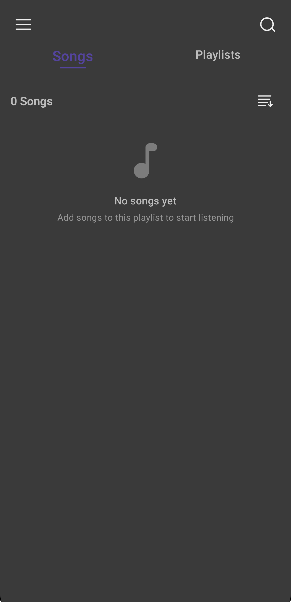
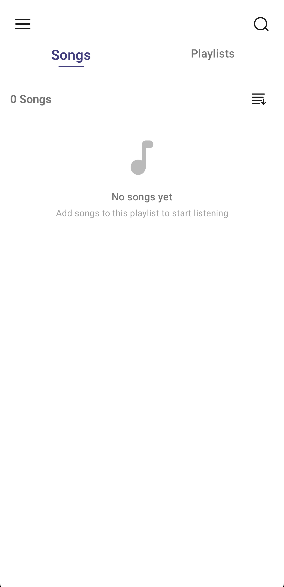
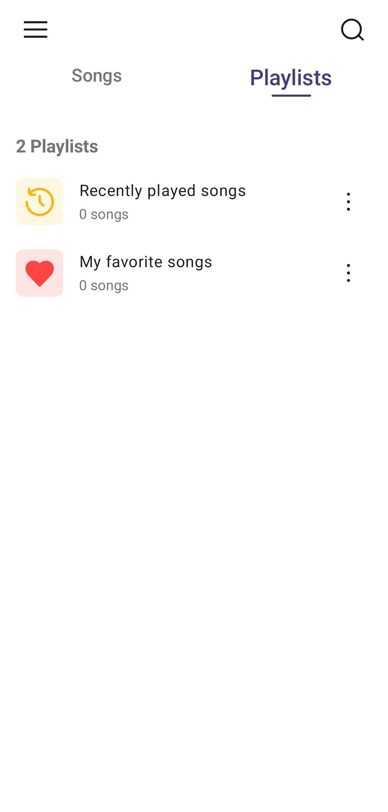
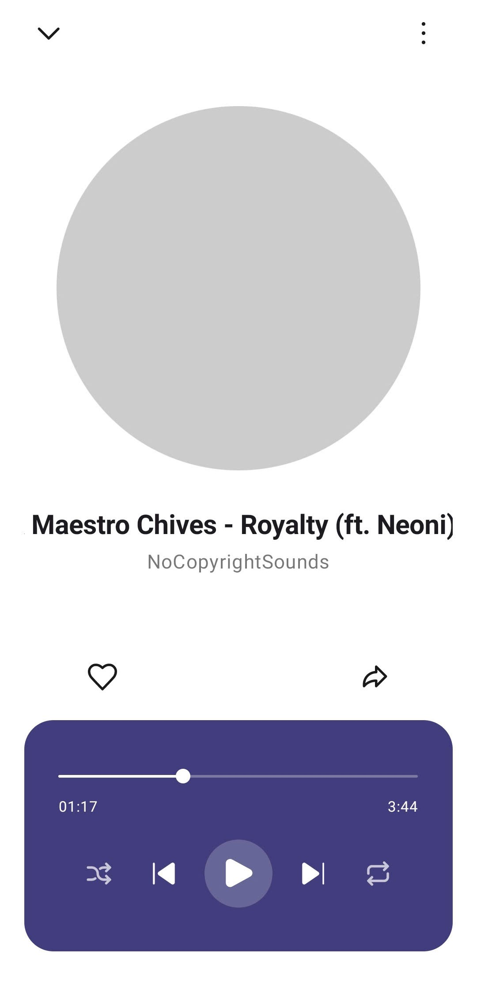
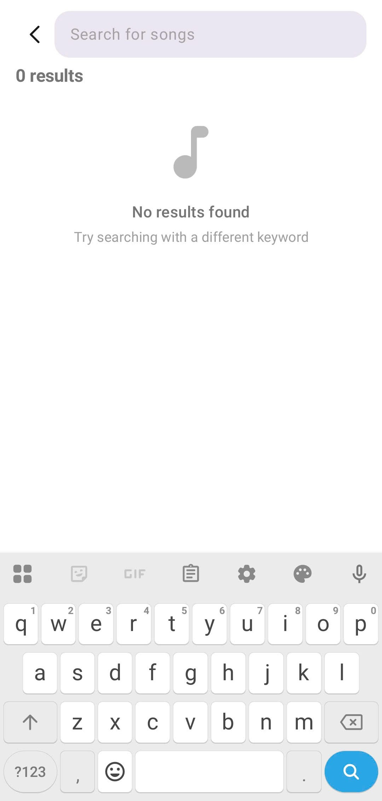
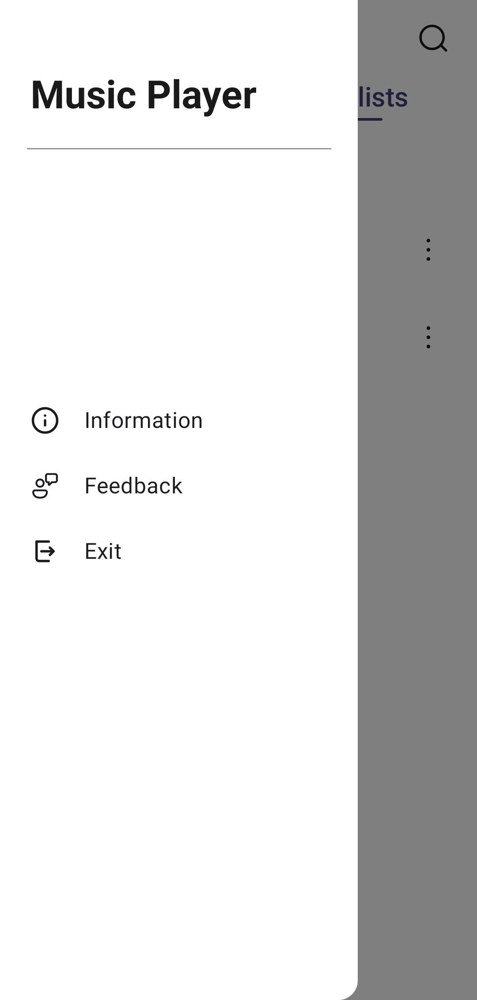
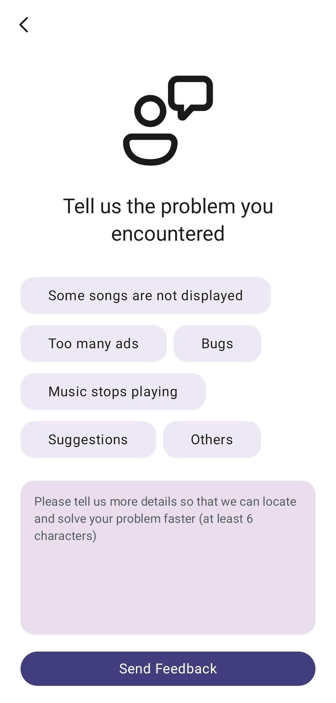

# Music Player (Android Kotlin)

A lightweight **offline music player** built with **Kotlin + Jetpack Compose**.  
The app reads audio files stored on the device, lets you **browse, search, sort**, and play tracks with a **mini player + full player** experience, plus **Favorites** and **Recently Played** playlists.

> ⚠️ Note: This repository contains the core app source code. Please open the project in Android Studio or any proper editor and make sure Gradle/Manifest resources match your local setup.

## Demo

- **Home**: Songs tab + Playlists tab  
- **Mini Player**: quick controls at the bottom  
- **Full Player**: album art, seek bar, shuffle/repeat, favorite, share, volume

  
  

  
  
  
  
  

## Features

### Playback
- Play/pause, next/previous
- Seek with progress bar
- Shuffle mode
- Repeat modes: **None / All / One**
- Animated album art (rotation while playing)

### Library
- Scan local audio files via `MediaStore` *(current filter: `/Download/`)*  
- Search by **title** or **artist**
- Sort songs by:
  - Song name
  - Artist name
  - Duration  
  (supports ascending/descending depending on option)

### Playlists & History
- **Favorites** (stored locally with Room)
- **Recently Played** (stored locally, keeps the latest ~100 items)

### Utilities
- Share an audio file using Android Sharesheet (via `FileProvider`)
- “Song details” bottom sheet (title/album/artist/duration/path, etc.)
- Feedback screen (opens email intent)

## Tech Stack

- **Kotlin**
- **Jetpack Compose** (Material 3)
- **Navigation Compose**
- **Hilt** (Dependency Injection)
- **Room** (local persistence for Favorites & Recently Played)
- Android **MediaPlayer** (playback)
- Android **MediaStore** (device audio query)
- **Dexter** (runtime permission handling)

## Requirements

- Android **10 (API 29)** or higher
- A physical device or emulator with local audio files

## Getting Started

1. Clone the repository
2. Open with **Android Studio** or any proper editor
3. Sync Gradle dependencies
4. Run on a device or emulator

### Permissions
The app requests audio read permission at runtime:
- Android 13+: `READ_MEDIA_AUDIO`
- Android 12 and below: `READ_EXTERNAL_STORAGE`

## Known Limitations (Current)

- Library scan is limited to **/Download/** by default.
- Metadata like genre/year may be unavailable depending on the file and query fields.
- No custom playlist creation UI yet (only built-in playlists: Favorites & Recently Played).

## License

This project is for learning/demo purposes.
